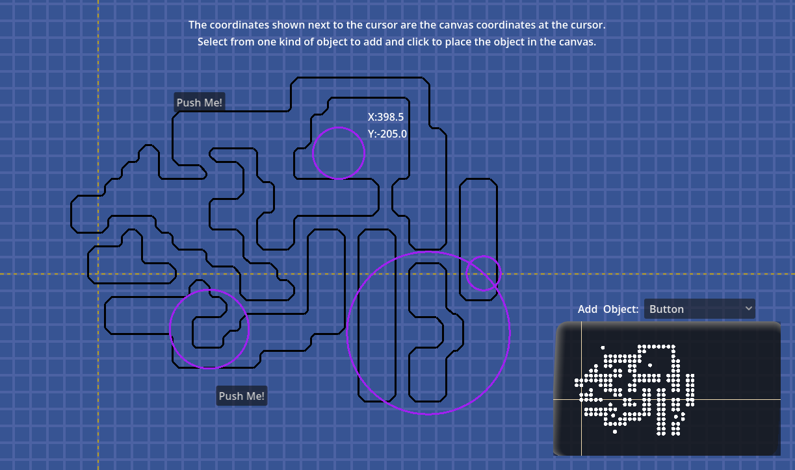

For Paracortical Initiative, 2025, Diogo "Theklo" Duarte

Other projects:
- [Bluesky for news on any progress I've done](https://bsky.app/profile/diogo-duarte.bsky.social)
- [Itchi.io for my most stable playable projects](https://diogo-duarte.itch.io/)
- [The Github for source codes and portfolio](https://github.com/Theklo-Teal)
- [Ko-fi is where I'll accept donations](https://ko-fi.com/paracortical)

# DESCRIPTION

# INSTALLATION
This isn't technically a Godot Plugin, it doesn't use the special Plugin features of the Editor, so don't put it inside the "plugin" folder. The folder of the tool can be anywhere else you want, though, but I suggest having it in a "modules" folder.

After that, the «class_name InfiCanvas» registers the node so you can add it to a project like you add any Godot node.

# USAGE
