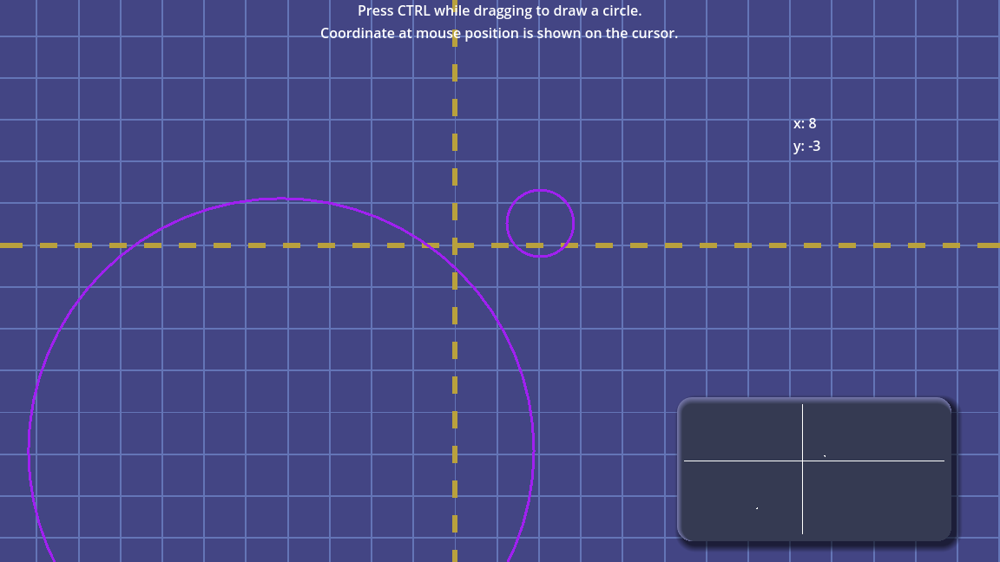

For Paracortical Initiative, 2025, Diogo "Theklo" Duarte

Other projects:
- [Bluesky for news on any progress I've done](https://bsky.app/profile/diogo-duarte.bsky.social)
- [Itchi.io for my most stable playable projects](https://diogo-duarte.itch.io/)
- [The Github for source codes and portfolio](https://github.com/Theklo-Teal)
- [Ko-fi is where I'll accept donations](https://ko-fi.com/paracortical)

# DESCRIPTION
This is an area which works as window to an infinite plane where various objects can be added. Spatial Hash Partitioning is used to decide which objects to display and box selection, enabling very high performance with thousands of objects. Multiple partition spaces can be used for different kinds of objects.

These objects can be pretty much anything with a `position` key or property, or a `get_rect()` method. You override functions to handle how they are displayed. Override functions also allow to change style, background patterns, what to do with selection boxes and other things.

The canvas can be panned with the middle mouse button and zoomed with the scroll wheel. Panning too far from the origin displays a compass.
The box selection can have two modes, like is typical in CAD programs.
Everything is highly extensible and customizable.

# INSTALLATION
This isn't technically a Godot Plugin, it doesn't use the special Plugin features of the Editor, so don't put it inside the "plugin" folder. The folder of the tool can be anywhere else you want, though, but I suggest having it in a "modules" folder.

After that, the «class_name InfiCanvas» registers the node so you can add it to a project like you add any Godot node. The InfiCanvas relies on the SpatialPartition Resource which is included. Either in script or in the inspector, set a partition name associated to an instance and you refer to that partition name to search objects.

An example scene that extends this node with a minimap is provided. It shows you Godot Control nodes being added to the canvas, a simple marching squares algorithm and circles.

# USAGE
The general style options like thickness of lines and colors can be set in the inspector. Being an extension of ColorRect, the background color of this node is set in the same way.
Partition size tells the resolution of object finding algorithm. Bigger partitions make search faster, but find more unintended objects.
Optionally you may run a QuadTree search to refine the results.
Wrapper functions use brute force on returned objects to discards false positives or false negatives depending on what's preferred.
These wrapper functions account for the rectangle, thus size of the objects. The zealous version of search algorithm rejects objects not completely enclosed by selection area. The tolerant version includes anything overlapping the selection area even if not contained.

# FUTURE IMPROVEMENTS
- Multi-threading for each partition?
- More selection options, like polygonal lasso, maybe?
